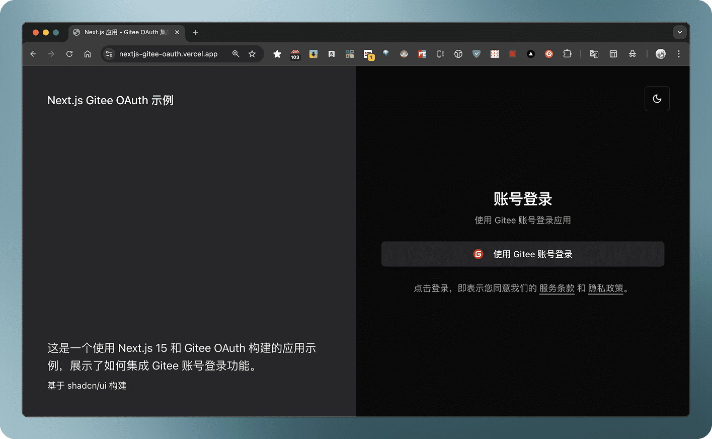

# Next.js Gitee OAuth 示例

 


这是一个使用 Next.js 15 和 Gitee OAuth 构建的应用示例，展示了如何集成 Gitee 账号登录功能。



## 特性

- ⚡️ [Next.js 15](https://nextjs.org/) 框架，使用 [Turbopack](https://turbo.wiki/pack) 提供极速开发体验
- 🔐 集成 [Gitee OAuth](https://gitee.com/api/v5/oauth_doc) 登录
- 🎨 基于 [shadcn/ui](https://ui.shadcn.com/) 构建的现代 UI
- 🌓 支持亮色/暗色主题，可跟随系统设置
- 📱 完全响应式设计
- 🚀 使用 [pnpm](https://pnpm.io/) 作为包管理器

## 快速开始

### 环境要求

- Node.js >= 18.17.0
- pnpm >= 8.0.0

### 安装

```bash
# 克隆项目
git clone https://gitee.com/normalcoder/nextjs-gitee-oauth.git
cd nextjs-gitee-oauth

# 安装依赖
pnpm install
```

### 开发

1. 复制环境变量文件：
    ```bash
    cp .env.example .env.local
    ```

2. 在 `.env.local` 中配置你的 Gitee OAuth 应用信息：
    ```env
    # Gitee OAuth 配置
    NEXT_PUBLIC_GITEE_CLIENT_ID=你的客户端 ID
    GITEE_CLIENT_SECRET=你的客户端密钥
    NEXT_PUBLIC_GITEE_REDIRECT_URI=http://localhost:3000/api/auth/callback/gitee 
    ```

3. 启动开发服务器：
    ```bash
    pnpm dev
    ```

现在你可以访问 http://localhost:3000 查看应用。

### 构建

```bash
# 生产环境构建
pnpm build

# 启动生产服务器
pnpm start
```

## 项目结构

```
.
├── app/            # Next.js 应用目录
│   ├── api/        # API 路由
│   ├── dashboard/  # 用户仪表盘页面
│   └── page.tsx    # 首页
├── components/     # React 组件
├── lib/            # 工具函数
└── public/         # 静态资源
```

## 开源许可

本项目基于 [MIT](./LICENSE) 发布
